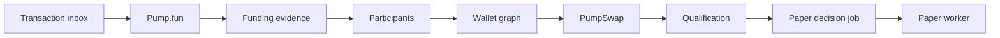

# Qualification canonique dans le pipeline d'observation — conception

Date : 2026-08-11
Issue : [#15](https://github.com/pivox/sol-token-listener/issues/15)
Statut : conception validée, spécification soumise à relecture

## 1. Objectif et périmètre

Cette PR branche la qualification Pump.fun directement dans le chemin durable
de chaque transaction observée. Une création, un trade de bonding curve, une
révision des participants ou du graphe de wallets, une migration ou une
activation PumpSwap reconstruit ainsi la qualification de chaque mint affecté.

La qualification devient une projection métier autonome. Elle ne dépend plus
du démarrage d'une décision paper pour exister et elle continue d'être révisée
même lorsqu'une session paper existe déjà.

La PR ne modifie pas les règles de score, les seuils, les reason codes, la
stratégie paper, les états des candidats, le comptage des achats externes ou les
adaptateurs de marché. Elle n'ajoute ni wallet, ni clé privée, ni construction,
signature, simulation RPC ou soumission de transaction.

## 2. État actuel et défaut corrigé

Le runtime persiste déjà les projections Pump.fun, sociales, participants,
wallet graph et PumpSwap. `QualificationRebuildService` sait transformer un
snapshot en rapport explicable et déterministe. Toutefois, ce service n'est
appelé que dans `PaperDecisionWorker`, après l'étape
`paper_decision_enqueue`.

Cette composition produit trois défauts :

1. le pipeline ne possède aucune étape `qualification` identifiable ;
2. un échec de qualification devient `DECISION_INVALID` dans la file paper au
   lieu d'un échec rejouable de la transaction observée ;
3. `reconcileExisting` réutilise le rapport d'une session déjà créée, donc de
   nouvelles preuves on-chain ne reconstruisent plus nécessairement la
   qualification courante.

La PR corrige ces défauts sans déplacer la stratégie paper dans le pipeline.

## 3. Approches considérées

### 3.1 Retenue : projection synchrone avant la file paper

`ObservedTransactionPipeline` reconstruit la qualification après les
projections participants, wallet graph et PumpSwap, puis seulement enfile la
décision paper. La reconstruction possède son propre port PostgreSQL, son
verrou par mint et sa transaction.

Ce choix rend la qualification disponible en mode `observe`, attribue les
échecs à l'étape exacte et garantit que la file paper voit au moins la dernière
projection canonique persistée.

### 3.2 Rejetée : conserver uniquement la qualification dans le worker paper

Cette option minimise les modifications mais ne satisfait ni l'étape explicite
du pipeline, ni la qualification systématique lorsqu'une session existe. Elle
conserve également un couplage incorrect entre qualification et paper trading.

### 3.3 Différée : une nouvelle outbox et un worker de qualification

Une file dédiée isolerait les latences et permettrait un débit indépendant,
mais ajouterait dès maintenant une deuxième mécanique de lease, retry,
checkpoint et santé. Le pipeline d'inbox fournit déjà le rejeu durable requis.
Cette complexité ne sera justifiée que si les mesures terrain montrent que la
reconstruction synchrone limite réellement le débit.

## 4. Architecture retenue



### 4.1 Frontières applicatives

Un nouveau `QualificationProjectionService` expose :

```text
rebuild(mint, missingCanonicalLaunchPolicy)
  -> UPDATED | UNCHANGED | DISSOLVED
```

Il dépend uniquement :

- d'un `QualificationProjectionRepository` ;
- du constructeur pur de rapport déjà porté par
  `QualificationRebuildService` ;
- du `QualificationEngine` et de son profil effectif immuable.

Le port de persistance suit les frontières déjà utilisées par les projections
participants et wallet graph :

```text
transact(mint, operation)
  transaction.loadCanonicalInput(mint)
  transaction.replaceProjection(rebuiltQualification)
  transaction.dissolveCurrent(mint)
```

Le snapshot canonique de qualification est extrait du type paper actuel. Il
contient seulement le lancement, un événement `asOf` possédant une provenance
raw, les métadonnées, les preuves sociales, le profil créateur, la distribution
des détenteurs et le graphe de wallets. `PaperDecisionSnapshot` référence le
rapport canonique courant et conserve séparément les candidats, sessions,
positions et trades propres à la stratégie.

### 4.2 Ordre du pipeline

Pour une transaction, l'ordre strict devient :

```text
create_observation
load_tracked_mints
launchpad_observation
reload_active_events
funding_observation
participant_analytics (par mint, ordre lexical)
wallet_graph (par mint, ordre lexical)
pumpswap_observation
qualification (par mint, ordre lexical)
paper_decision_enqueue (par mint, ordre lexical)
```

La liste de qualification est l'union dédupliquée et triée des mints affectés
par Pump.fun, les projections actives de la signature et PumpSwap. PumpSwap
reste avant la qualification afin qu'une migration ou activation de pool soit
visible dans le snapshot canonique du même traitement.

`ObservedPipelineStage` ajoute la valeur stable `qualification` et
`ObservedPipelineResult` ajoute `qualificationRebuildCount`. Un échec stoppe le
traitement avant l'enqueue paper du mint concerné et devient
`ObservedPipelineError('qualification', mint)`. L'inbox marque alors l'essai
comme rejouable selon sa politique existante.

## 5. Reconstruction canonique

### 5.1 Données autorisées

Le repository charge exclusivement des lignes persistées dont la preuve source
n'est pas `orphaned`. Il ne réalise aucun appel RPC ou HTTP et ne lit aucun état
en mémoire. Les faits absents restent `UNKNOWN`.

Les preuves sociales sont reconstruites depuis la collection active et ses
tables normalisées (`social_evidence_collections`, `social_links`, observations
HTTP et preuves de vérification), toutes reliées à des événements actifs. Les
métadonnées proviennent du `metadata_snapshot_id` de cette collection lorsqu'il
existe ; une lecture « dernier snapshot par date » indépendante est interdite,
car elle pourrait réintroduire un snapshot issu d'un lancement orphaned.

Dans cette étape synchrone, `buyQuote` et `reverseSellQuote` valent
`undefined`. Les conditions liées aux quotes restent donc inconnues ; elles ne
sont ni transformées en échec ni présentées comme une preuve de sellabilité.
Les quotes passives restent des préconditions propres au candidat paper : elles
ne créent pas une seconde variante du rapport de qualification canonique.

L'événement `asOf` est la preuve canonique active la plus récente qui possède un
`raw_event_id`, selon le curseur Solana complet puis l'identifiant déterministe
comme départage. Les projections dérivées participants et wallet graph
conservent dans leur payload leur propre `asOf.eventId`, lequel remonte à cette
provenance raw ; elles ne sont jamais choisies comme source SQL directe si leur
`raw_event_id` est nul. La confirmation du rapport est exactement celle de
l'événement raw-backed retenu ; les statuts des autres projections restent
présents dans leurs snapshots respectifs et ne sont jamais promus
artificiellement. Aucun `number` financier n'est introduit ; concentrations et
seuils restent en `bigint`.

### 5.2 Identité et révisions

Le rapport conserve l'identité existante fondée sur :

- mint ;
- id, version et fingerprint du profil effectif ;
- fingerprint canonique des preuves ;
- événement `asOf` et statut de confirmation.

`QualificationUpdated` utilise la source métier stable `qualification`, la
provenance Solana de l'événement `asOf`, le `reportId` comme qualifier et le
payload version `1` existant. Son payload ajoute l'entrée d'évaluation canonique
(`signals`, blockers amont et faits calibrés) utilisée pour produire le rapport.
Cette entrée bigint-safe est validée, bornée et immuable ; elle ne contient ni
contenu social brut ni donnée RPC.

Une répétition exacte retrouve les mêmes `reportId` et `eventId`. Les clauses
uniques et `ON CONFLICT DO NOTHING` empêchent une deuxième ligne, un deuxième
événement et une deuxième révision SSE. Une modification réelle de preuve, de
finalité ou de profil produit une nouvelle identité déterministe.

Le nouveau repository est l'unique écrivain de `qualification_reports` et de
`QualificationUpdated`. `PostgresPaperDecisionRepository` ne tente plus
d'insérer ou de superséder un rapport : sous son verrou existant, il vérifie que
le `reportId` canonique fourni existe, reste courant, actif et cohérent avec le
mint, le profil et l'événement transmis, puis persiste candidat et décision
paper. Cette autorité unique interdit deux `eventId` ou deux révisions SSE pour
un même rapport.

Le moteur conserve sa protection d'autorité par identité d'objet. Après une
reprise, le worker ne fait donc pas confiance à un objet JSON désérialisé : il
rejoue l'entrée d'évaluation persistée avec le même profil effectif et le même
sujet `(mint, qualificationEventId)`, compare strictement le rapport recalculé,
le `reportId`, l'empreinte des preuves et l'identité de l'événement aux valeurs
stockées, puis utilise seulement le nouvel objet autorisé en mémoire. Une
discordance échoue fermée avant toute écriture candidat ou paper. Cette
réautorisation ne reconstruit pas les projections, ne modifie pas le rapport et
ne publie aucun événement.

### 5.3 Concurrence et reorg

Chaque reconstruction s'exécute dans une transaction PostgreSQL sous verrou
transactionnel déterministe par mint. Le verrou couvre le chargement canonique,
la comparaison avec le rapport courant, la supersession éventuelle, l'insertion
du rapport et l'événement/outbox associé. L'algorithme est fermé :

1. charger le rapport courant et vérifier si son événement source est toujours
   actif ;
2. charger le snapshot canonique complet en excluant toute source `orphaned` ;
3. dissoudre le courant si aucun lancement canonique ne subsiste ;
4. construire le rapport cible depuis le snapshot courant, sans comparer son
   curseur au curseur historique du rapport précédent ;
5. retourner `UNCHANGED` si le rapport cible est déjà le courant ;
6. sinon superséder le courant, puis insérer le rapport cible ou réactiver sa
   ligne historique si son identité déterministe existe déjà.

Le pipeline inbox est sérialisé et chaque reconstruction relit l'état complet
de la base. Un replay tardif d'une ancienne transaction ne reconstruit donc pas
un ancien snapshot : il retrouve le même état canonique courant.

Si le lancement canonique n'existe plus :

- avec la politique `ERROR`, la reconstruction échoue de façon typée ;
- avec `DISSOLVE_CURRENT`, utilisée pour une observation `orphaned`, la
  projection courante est dissoute et aucune preuve de remplacement n'est
  inventée.

Si seule une preuve récente devient `orphaned`, le snapshot est reconstruit
depuis les preuves actives restantes, même si son curseur `asOf` recule. Le
rapport qui dépendait de la preuve orpheline est supersédé. Si le rapport de
repli existait avant le fork, sa ligne redevient courante sans dupliquer son
événement déterministe ; la mise à jour de finalité/orphaning déjà publiée dans
l'outbox est le signal de reprise qui impose aux consommateurs de relire la
projection risque. S'il n'existait pas, le rapport et son événement sont
insérés normalement. Les rapports et événements historiques sont conservés
jusqu'à leur purge normale de quatre heures.

## 6. Interaction avec le paper trading

La qualification autonome précède toujours `paper_decision_enqueue`. Le worker
paper charge le rapport canonique courant produit par cette étape et conserve
la responsabilité des quotes, du candidat, de la session et de la position. Il
ne reconstruit et ne persiste plus `QualificationUpdated`. L'allowlist, la
présence des quotes BUY/SELL, leur fraîcheur et la perte aller-retour restent
validées par `TradingCandidateService` et `PaperTradingEngine` avant toute
écriture paper.

Pour cette PR, le chemin `reconcileExisting` n'est pas transformé en moteur de
révocation de candidat : ce comportement appartient à l'issue #16.
Une nouvelle création de candidat exige le rapport canonique courant. La reprise
ou réconciliation d'un candidat déjà persisté peut relire son rapport historique
supersédé, mais uniquement par lignée exacte candidat/rapport/événement et après
la même réautorisation déterministe et structurelle ; elle ne peut jamais
utiliser ce rapport historique pour ouvrir une nouvelle position.

En revanche, l'existence d'une session paper n'empêche jamais la nouvelle étape
du pipeline de publier la qualification canonique courante. L'API risque et la
timeline peuvent donc expliquer une vente créateur, un cluster ou un reorg
survenu après l'entrée, même avant l'évolution de la stratégie paper.

Le mode `observe` exécute exactement la même projection de qualification mais
ne crée toujours aucune session, position ou transaction paper. Aucun mode live
n'est ajouté.

## 7. Persistance et compatibilité du schéma

La table `qualification_reports` et l'événement
`QualificationUpdated` de la migration `013_paper_e2e.sql` restent les contrats
autoritaires. Le schéma autorise déjà un rapport sans candidat, une seule
projection courante par mint/profil, sa supersession et sa purge. Cette PR
n'ajoute donc aucune migration : les tests de migrations 001–013 démontrent que
le nouveau chemin fonctionne sur une base vide et reste compatible avec les
rapports actuels.

Les données brutes restent séparées des projections. Le rapport référence
l'événement domaine `asOf` et son `raw_event_id`. La rétention demeure quatre
heures et la purge continue de supprimer les enfants avant leurs sources. Aucun
rapport, candidat ou événement existant n'est supprimé par ce déploiement.

## 8. API, métriques et santé

Les routes risque, détail, timeline et SSE réutilisent déjà
`qualification_reports` et `QualificationUpdated` ; aucun nouveau endpoint
n'est nécessaire.

Le contrat santé V1 reçoit deux ajouts bornés :

- `pipeline.qualification`, avec les mêmes états fermés
  `IDLE | RUNNING | DEGRADED | STOPPED` que le worker d'inbox synchrone ;
- `qualification.currentCount` et `qualification.lastSuccessAt`, calculés sur
  les rapports courants dont l'événement source n'est pas `orphaned`.

`pipeline.qualification` reflète l'état du worker inbox, car l'étape est
synchrone dans ce worker ; la disponibilité de la requête de métriques peut
uniquement le faire passer à `DEGRADED`. Une erreur de cette requête dégrade la
composante qualification et le statut global. Les compteurs de backlog et
d'essais épuisés de l'inbox restent l'indicateur durable d'un échec rejouable.
Aucun message d'erreur, payload, mint ou endpoint RPC n'est exposé dans
`/api/v1/health`.

## 9. Erreurs

Les erreurs publiques restent typées et assainies :

- mint absent ou snapshot incohérent : erreur de reconstruction ;
- lancement canonique absent en traitement actif : erreur typée et rejouable ;
- échec SQL : erreur repository sans cause sensible ;
- échec du moteur ou payload invalide : `ObservedPipelineError` à l'étape
  `qualification` ;
- lancement absent pendant un reorg : dissolution idempotente.

Le pipeline ne journalise pas le contenu des métadonnées, les preuves sociales,
les adresses RPC ou les erreurs brutes.

## 10. Tests

### 10.1 Unitaires

- extraction du snapshot générique sans dépendance paper ;
- preuves absentes conservées `UNKNOWN` ;
- déterminisme du fingerprint, du rapport et de l'événement ;
- changement d'identité pour preuve ou finalité réellement modifiée ;
- ordre lexical, union/déduplication des mints et nouveau compteur pipeline ;
- attribution exacte d'un échec à `qualification` et arrêt avant enqueue ;
- sécurité des objets hostiles, tableaux bornés et absence de `any`.
- réautorisation après désérialisation exacte et rejet de toute altération du
  rapport, de l'évaluation, du profil, du sujet ou des empreintes ;

### 10.2 Intégration repository

- création : un rapport courant ;
- achat puis vente : deux révisions explicables, vente créateur éliminatoire ;
- changement de cluster : fingerprint et révision modifiés ;
- migration/activation PumpSwap : mint reconstruit dans la même transaction
  observée ;
- replay exact : aucune ligne, événement ou révision SSE en double ;
- montée `confirmed` vers `finalized` : révision déterministe ;
- passage `orphaned` du lancement : projection courante dissoute ;
- passage `orphaned` d'une preuve récente : rapport dépendant supersédé,
  rapport actif antérieur précisément réactivé, aucune preuve orpheline dans le
  résultat et aucune duplication de son événement ;
- deux reconstructions concurrentes du même mint : une seule projection
  courante ;
- migrations sur base vide puis replay complet.

### 10.3 Runtime, API et sécurité

- composition réelle du service dans `createProductionListenerRuntime` ;
- `observe` publie la qualification mais aucune écriture paper ;
- santé nominale et dégradation isolée des métriques qualification ;
- API risque, timeline et SSE lisent la nouvelle projection autonome ;
- garde d'import confirmant l'absence de wallet, signature ou soumission.
- frontend opérateur aligné sur les nouveaux champs de santé, avec schéma,
  fixtures et tests E2E mis à jour.

Commandes d'acceptation :

```text
npm run build
npm run check
npm run lint
npm run docs:check
npm test
TEST_DATABASE_URL=... npm test
```

Les tests PostgreSQL live restent conditionnés par `TEST_DATABASE_URL`, mais la
PR ne peut être fusionnée qu'après leur exécution dans un environnement qui le
fournit ou après succès du job CI PostgreSQL équivalent.

## 11. Fichiers prévus

Principaux ajouts et modifications :

- `src/ports/qualification-projection-repository.ts` ;
- `src/application/qualification-projection.service.ts` ;
- `src/application/qualification-rebuild.service.ts` ;
- `src/application/observed-transaction-pipeline.ts` ;
- `src/application/production-listener-factory.ts` ;
- `src/storage/qualification-projection.repository.ts` ;
- adaptation du repository paper pour vérifier et référencer le rapport
  canonique sans l'écrire ;
- contrats et projection `/api/v1/health` ;
- tests unitaires, repository, pipeline, runtime, migration et API associés ;
- documentation d'architecture uniquement si le contrat public change.

## 12. Critères de sortie

La PR est terminée uniquement si :

1. chaque mint affecté est qualifié après les projections canoniques et avant
   la file paper ;
2. l'étape `qualification` et son mint sont visibles dans
   `ObservedPipelineError` ;
3. replay, concurrence, finalité et orphaning ne laissent jamais deux
   projections courantes ou une preuve orpheline active ;
4. une preuve réellement modifiée produit une nouvelle révision déterministe ;
5. les routes existantes exposent le rapport autonome sans couplage au candidat
   paper ;
6. la santé expose l'état et les métriques minimales sans donnée sensible ;
7. `observe` reste le mode par défaut et aucune capacité d'exécution réelle
   n'entre dans le graphe d'import ;
8. build, TypeScript strict, lint, documentation, tests unitaires et tests
   PostgreSQL passent ;
9. aucun comportement Raydium CPMM n'est supprimé ou activé dans le flux
   Pump.fun principal.
